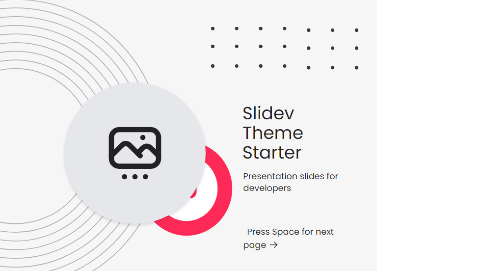

# slidev-theme-slidev-aida-theme

A Aida theme for [Slidev](https://github.com/slidevjs/slidev).

Live demo

## Install

Add the following frontmatter to your `slides.md`. Start Slidev then it will prompt you to install the theme automatically.

<pre><code>---
theme: <b>slidev-aida-theme</b>
---</code></pre>

Learn more about [how to use a theme](https://sli.dev/themes/use).

## Layouts

This theme provides the following layouts:

- intro
- cover
- center
- default
- order paper
- two thirds

## Components

This theme provides the following components:

- order paper item

## Contributing

- `npm install`
- `npm run dev` to start theme preview of `example.md`
- Edit the `example.md` and style to see the changes
- `npm run export` to generate the preview PDF
- `npm run screenshot` to generate the preview PNG
